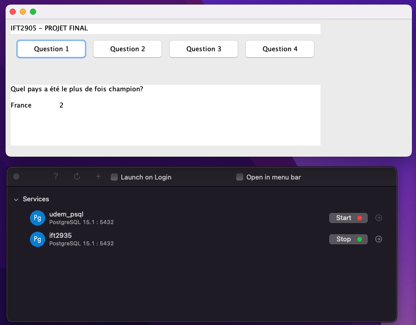
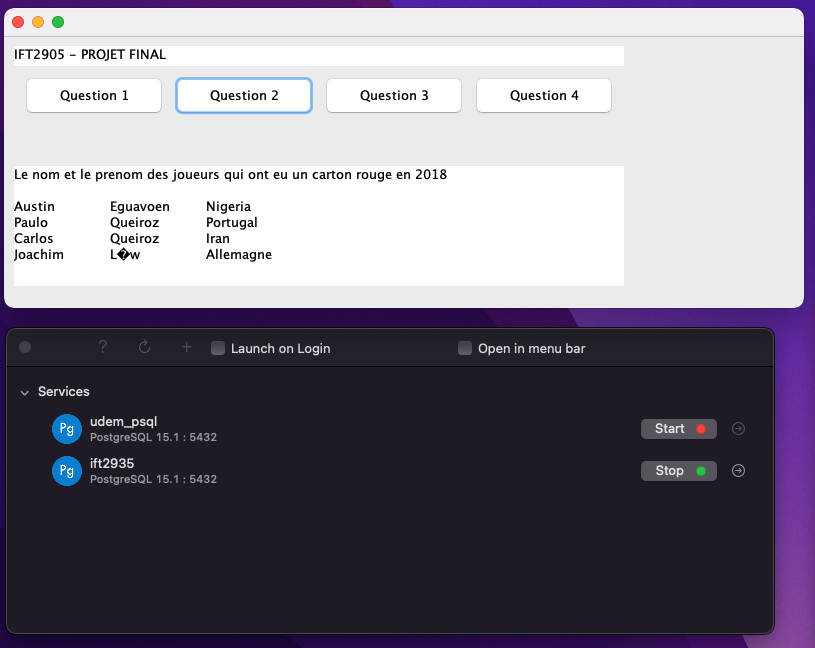
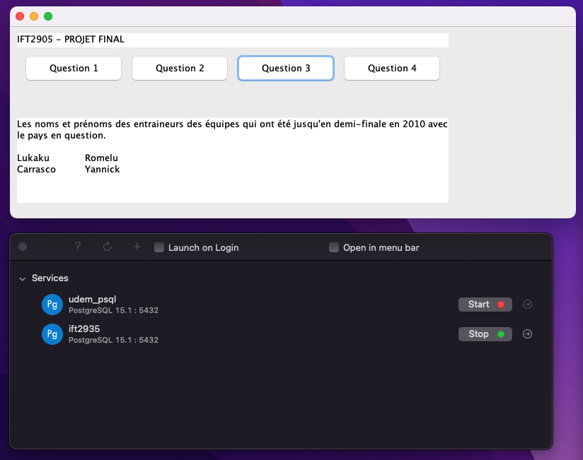
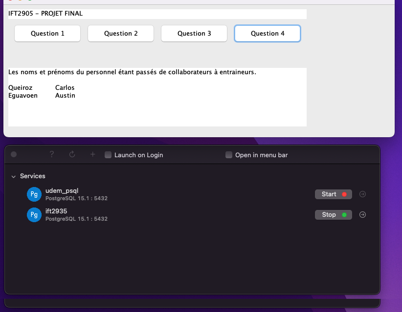

# README.md

## Projet IFT2935

## Variables d'environnement

Ce projet d'école nécessite que l'évaluateur CRÉÉ son propre fichier `.env` à la racine du dossier du projet avec les champs suivants :

- `username`
- `password`
- `url` (au format Postgres pour qu'Hibernate puisse le comprendre)

Un exemple de fichier `.env` est fourni `.env.example`.

```
USERNAME=postgres
PASSWORD=
URL=jdbc:postgresql://localhost:5432/postgres
```

## Création de la structure de la base de données
Vous devez créer un serveur postgresql sur votre machine et executer l'unique script SQL suivant:
- `queries/script.sql`

De cette façon, vous aurez une base de données avec les tables et les données nécessaires pour faire fonctionner l'application.

## Prérequis

Pour exécuter ce projet Java à partir du code source, vous aurez besoin des éléments suivants :

- JDK 11 ou version ultérieure installée sur votre machine
- Un environnement de développement intégré (IDE) comme IntelliJ ou Eclipse
- Les dépendances Maven spécifiées dans le fichier `pom.xml`

## Installation

1. Clonez le projet depuis GitHub
2. Ouvrez le projet dans votre IDE
3. Configurez votre fichier `.env` à la racine du dossier du projet avec les informations requises
4. Installer les dépendances Maven à l'aide de votre IDE, ou en exécutant la commande `mvn install` dans le dossier du projet.
5. Exécutez l'application avec votre IDE.

## Guide d'utilisation
Chaque bouton de l'interface effectue la requête SQL reliée à sa question. Les résultats sont affichés dans l'interface sous forme de texte.

#### Question 1


#### Question 2


#### Question 3


#### Question 4



## Fichier .jar

Il est à noter que le fichier .jar fourni effectue une connexion à un serveur postgresql avec le fichier .env suivant:

```
USERNAME=postgres
PASSWORD=
URL=jdbc:postgresql://localhost:5432/postgres
```

Si vous désirez utiliser le fichier .jar avec une autre base de données, vous devez modifier le fichier .env et recompiler le projet.